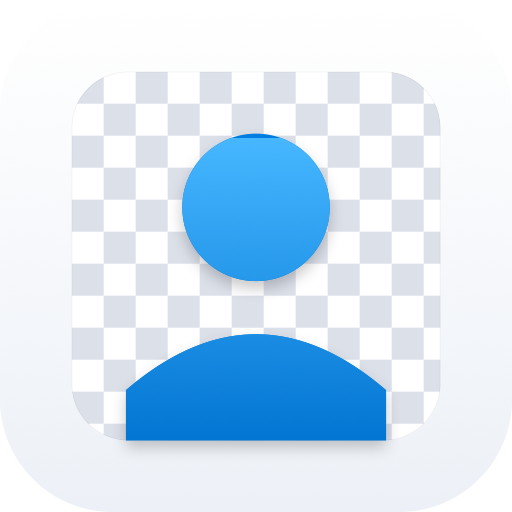
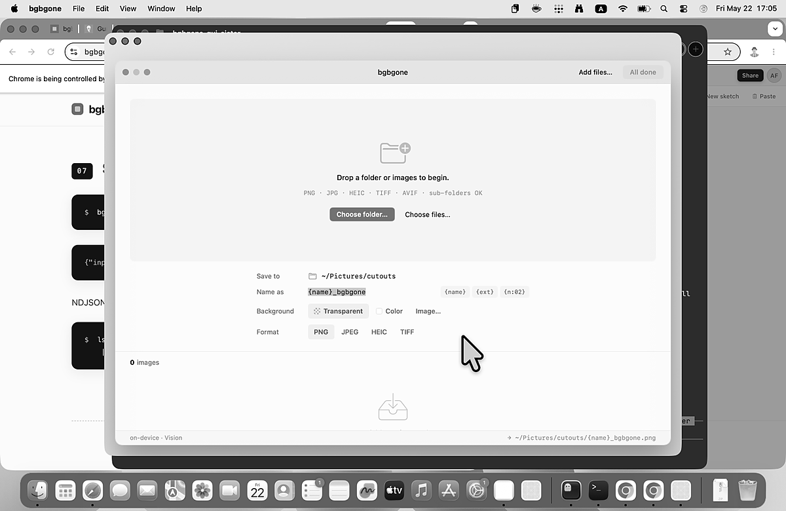

# bgbgone.app

<p align="center">
  
</p>

**Background, be gone!** — the macOS GUI for [`bgbgone`](https://github.com/Arthur-Ficial/bgbgone).

Drop a folder of images. Watch it process. End up with a folder of clean cutouts. 100% on-device (Apple Vision), batchable, never touches the network.

`bgbgone.app` is a thin wrapper around the `bgbgone` CLI — there is no image-processing logic in this repo. The GUI exists to make the same UNIX tool ergonomic for visual workflows: bulk product photography, headshot batches, content cleanup. For automation, scripting, and pipelines, use the CLI directly.



## Install

```bash
brew tap Arthur-Ficial/tap
brew install --cask bgbgone-app
```

Or grab the signed + notarised `.zip` from the [latest release](https://github.com/Arthur-Ficial/bgbgone.app/releases/latest).

The cask ships with `bgbgone` embedded as a fallback, so it works out of the box. If you already have `bgbgone` installed via `brew install Arthur-Ficial/tap/bgbgone`, the app uses your installed version (keeping the CLI and GUI in lockstep).

## How it works

1. Drop a folder (or images) onto the window.
2. The app scans recursively, surfaces a batch in the file list, and shows live counts.
3. Configure: output folder, name pattern, background (Transparent / Color / Image), format (PNG / JPEG / HEIC / TIFF).
4. Hit **Remove background from N**. Each file runs through `bgbgone <input> -o <output> --json --quiet` as a separate Process; up to 4 in parallel.
5. Outputs appear at your chosen folder, named by your chosen pattern.

## Apple Silicon, macOS 26+

This app is a SwiftUI 6.3 / macOS 26 single-window app. It carries no media libraries beyond `ImageIO` (used only to read thumbnails and `width × height × bytes`). All segmentation work is delegated to the embedded `bgbgone` binary.

## Project family

| Tool | What | Framework |
|------|------|-----------|
| [apfel](https://github.com/Arthur-Ficial/apfel) | LLM | FoundationModels |
| [auge](https://github.com/Arthur-Ficial/auge) | Vision / OCR | Vision |
| [bgbgone](https://github.com/Arthur-Ficial/bgbgone) | Background removal CLI | Vision + CoreImage |
| **bgbgone.app** (this) | GUI for bgbgone | SwiftUI |

## Development

See [CLAUDE.md](CLAUDE.md) for project rules. TL;DR:

```bash
make test           # swift test
make app            # builds build/bgbgone-app.app (ad-hoc signed)
make run            # build + open
make release        # bump .version, sign, notarize, release, update tap (Arthur only)
```

The design source-of-truth lives in [`design/`](design/) — open `design/project/bgbgone.html` in a browser to step through every UI state via the Tweaks panel. Swift implementation must match those mockups pixel-for-pixel.
